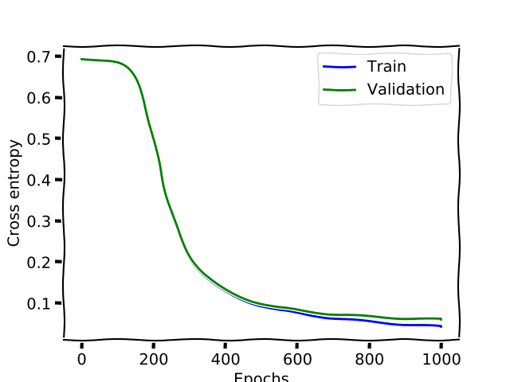
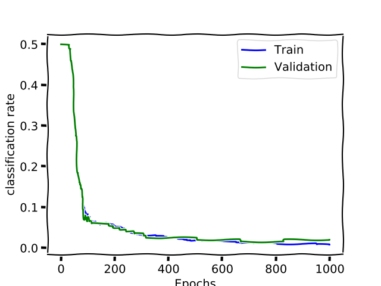
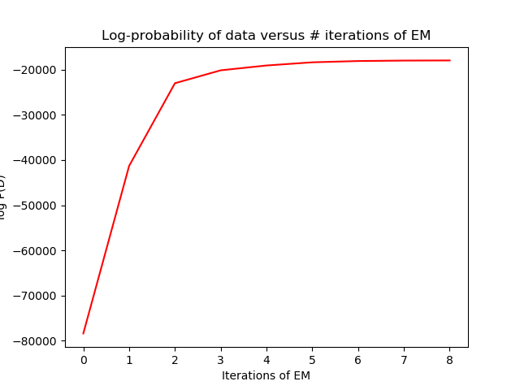

Overview
In this assignment, you will experiment with a neural network and the mixture of *Gaussians*
model. Some code that implements a neural network with one hidden layer, and the mixture
of Gaussians model will be provided for you (both MATLAB and Python).
You will be working with the following dataset:
Digits: The file digits.mat contains 6 sets of 16×16 greyscale images in vector format (the
jpixel intensities are between 0 and 1 and were read into the vectors in a raster-scan manner).
The images contain centered, handwritten 2’s and 3’s [^1], scanned from postal envelopes. train2
and train3 contain examples of 2’s and 3’s respectively to be used for training. There are 300
examples of each digit, stored as 256×300 matrices. Note that each data vector is a column
of the matrix. *Valid2* and *valid3* contain data to be used for validation (100 examples of
each digit) and *test2* and *test3* contain test data to be used for final evaluation only (200)


# Backpropagation for Convnets


You are training a Convolutional Neural Network (CNN) by minimizing the cross-entropy:

* The input is $32 \times 32$ image [^2]
* The first (and only) hidden layer is **convolutional**. There are $F$ number of filters with size $w\times h$. The activation function is **RELU**.
* The output layer is _fully-connected_ and has 3 units. It has the **soft-max** activation function.


How many weights are there in the model? Explain how back propagation works, and derive
equations for the updates for each weight in the model. How many operations does the forward pass require?

<!-- TODO: Answer the question -->


# Neural Networks

Code for training a neural network with one hidden layer of logistic units, logistic output units and a cross entropy error function is included. 

* **nn.py** : contains all the methods for initializing, training and validating the model.


## Basic Generalization

Train a neural network with 10 hidden units. You should first use `Init` to initialize the
net, and then execute train nn repeatedly (more than 5 times). Note that train nn runs
100 epochs each time and will output the statistics and plot the error curves. Alternatively, if
you wish to use Python, set the appropriate number of epochs in nn.py and run it. Examine
the statistics and plots of training error and validation error (generalization). How does the
network’s performance differ on the training set versus the validation set during learning?

> **Both errors are decreasing and (as expected) the training error is always inferior the validation and test error.**


Show a plot of error curves (training and validation) to support your argument.

{#id .marginfigure width=12cm height=8cm }

Caption : Cross entropy loss for a simple Neural network with a hidden layer


## Classification error 

You should implement an *alternative performance* measure to the cross entropy, the **mean
classification error**[^3]. You should then count up the total number of examples
that are classified incorrectly according to this criterion for training and validation respectively, and maintain this statistic at the end of each epoch. Plot the classification error vs.


Here is the code of the added  function to compute the classification rate:

~~~{#function_classification .python }

def classfication_rate(inputs, target, W1, W2, b1, b2):
    """ Evaluat the classification  rate on the model"""

    h_input = np.dot(W1.T, inputs) + b1  # Input to hidden layer.
    h_output = 1 / (1 + np.exp(-h_input))  # Output of hidden layer.
    logit = np.dot(W2.T, h_output) + b2  # Input to output layer.
    prediction = 1 / (1 + np.exp(-logit))  # Output prediction.

    #max prediction
    prediction = (prediction <=0.5)   #if proability higher than 0.5 class 1

    return 1 - np.mean(prediction != target)
~~~

{#id .marginfigure width=12cm height=8cm }

caption: Classification error rate.


## Learning rate

Try different values of the **learning rate** $\epsilon$.

* You should reduce it to $0.01$.
* Increase it to $0.2$ and $0.5$.

> What happens to the convergence properties of the algorithm?


* Also try different values of the momentum in $\{0.0,0.5,0.9\}$.

> **Generally we use cross-validation to set the best parameter**.

## Number of hidden units

Set the learning rate $\epsilon=0.02$, momentum to $0.5$ and try different number of hidden units on the problem [^4].

> Describe the effect of this modification on the convergence properties, and the generalization of the network.


With this setup, the model lacks the number of iteration to converge since to the learning rate is **small** and the maximum allowed _epochs_ is also reduced to $100$.


## Compare $k$-NN and Neural Network

Try $k$-NN on this digit classification task using the code developed in the first assignment[^5], and compare the result with those you got using neural networks. Briefly comment on the differences between these classifiers.


~~~{#knn .python}

  inputs_train, inputs_valid, inputs_test,\
  target_train, target_valid, target_test \
  = LoadData('digits.npz')

  knn_valid_target =run_knn(K,inputs_train.T\
  ,target_train.T,inputs_valid.T).squeeze()
  knn_test_target =run_knn(K,inputs_train.T\
  ,target_train.T,inputs_test.T).squeeze()

  knn_valid_error = 1- mean(knn_valid_target==target_valid)
  knn_test_error = 1- np.mean(knn_test_target==target_test)

  print("{:2d}-NN valiation error={:4.2f},test error={:4.2f}"\
  .format(K,knn_valid_error,knn_test_error))

~~~

We obtain a similar error $2\%$ with $k=10$. This error increases with a higher $k$.


# Mixture of Gaussians


## Training


Train your model on the **train2** and **train3**, which contains training examples of handwritten *two* and *threes* [^6].


## Initializing a s mixture of Gaussians with $k$-means

Training a MoG model with many  components tends to be slow. People have found that the means of the mixture components by running a few iterations  of the $k$-means tends to **speed** up the convergence. You should experiment this method of initialisation. You should do the following.

* Read and understand the methods in the `kmeans.py` module.
* Change the *initialisation* of the means in `mogEm.py` to use the $k$-means algorithm [^7]

Here is the result of the **moG** without proper initialization


{#id .marginfigure width=13cm height=4cm }


Now we change the means initialisation with $k$-means.

```python
#--------------------  Add your code here --------------
# mu = mn + np.random.randn(N, K) * (np.sqrt(vr)/randConst)
mu = KMeans(x, 2, 5)
```


{#id .marginfigure width=13cm height=4cm }


We could see that with proper *initialization* we achieve a higher value for the **log likelihood**.


## Classification using MoGs

Now we will investigate using the trained mixture models for classification. The goal is to decide which digits class $d$ a new input image $x$ belong to.

[^1]: This turns out to be a **binary** classification problem instead of $K$ classes.

[^2]: grayscale, not RGB
[^3]: You can consider the output correct if the correct label is given a higher probability than the incorrect label

[^4]: You should use two values {2,5} which are smaller than the original two others {30,100}

[^5]: I'm intrigued to use *scikit-learn*.

[^6]: Try different values for number of mixtures and minimum variance.


[^7]: Use $5$ iterations for the $k$-means.

